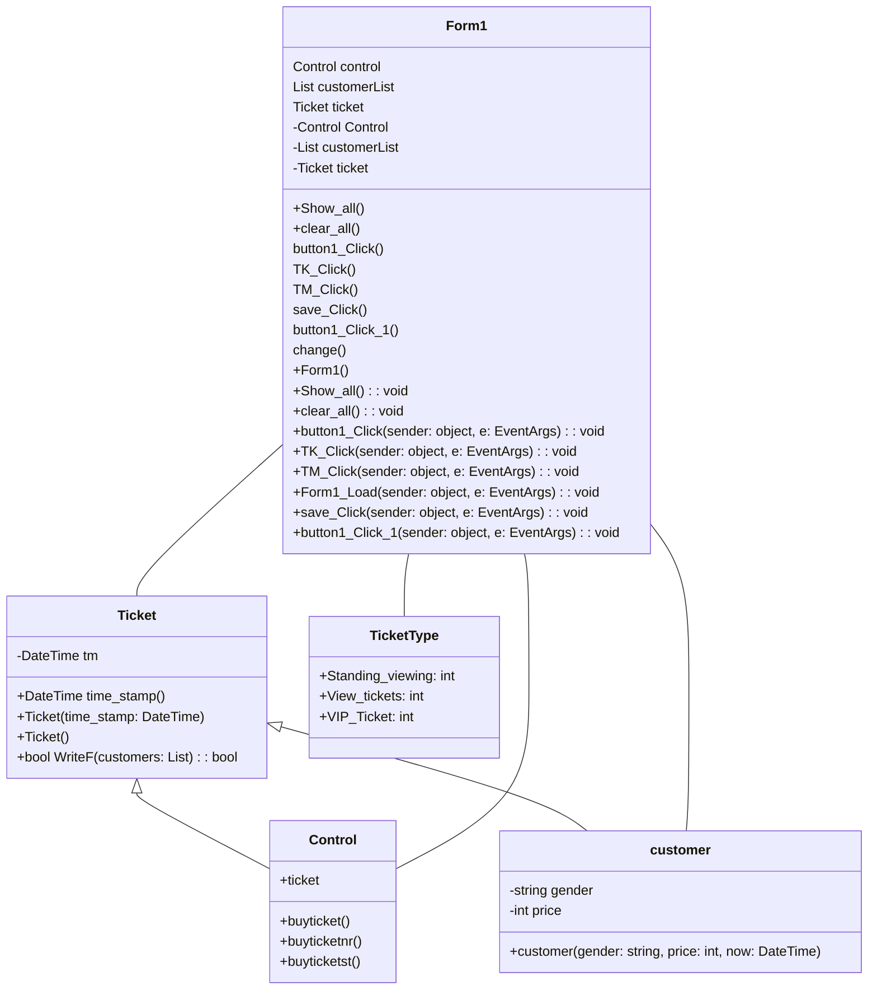

# final-project
1.ความเป็นมาของโปรแกรม

ผมเห็นการต่อแถวซื้อบัตรเข้าไปดูพวกคอน หรือ หนังการแปลง
ผมเห็นว่าบางที่ยังไม่มีการนำเทคโนโลยีมาใช้
ผมจึงอยากนำสิ่งที่ผมได้เรียนมาใช้ครับ

2.วัตถุประสงค์ของโปรแกรม
ทำระบบการจองบัตรคอนแบบต่อแถวซื้อทีละคน

3.โครงสร้างของโปรแกรม (Class diagram) ของโปรแกรม ใช้ Mermaid ในการเขียน ตัวอย่าง การเขียน Classdiagram ใน Markdown

4.ชื่อของผู้พัฒนาโปรแกรม
นาย นวพรหม ภูผาผิว 663450040-2
 
